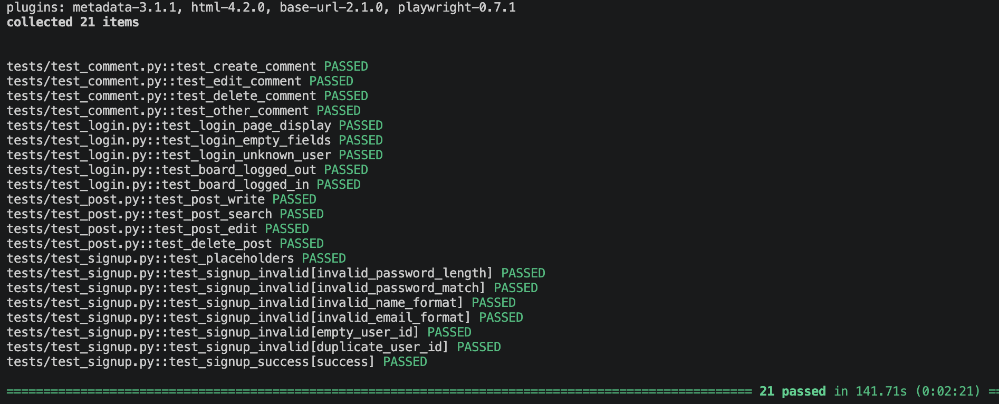

# post_test_automation

웹 게시판 서비스의 테스트 자동화 프로젝트입니다.
Playwright + pytest 기반으로 로그인 / 회원가입 / 게시글 / 댓글 기능의 주요 시나리오를 자동화했습니다.

> **현재 상태: 1차 구현 완료 (v0.1)**
> 테스트 코드 리뷰를 통해 도출한 개선 과제는 [개선 로드맵](#개선-로드맵)에 정리하여 반영 예정입니다.

---

## 목차

- [기술 스택](#기술-스택)
- [테스트 대상](#테스트-대상)
- [프로젝트 구조](#프로젝트-구조)
- [테스트 커버리지](#테스트-커버리지)
- [실행 방법](#실행-방법)
- [실행 결과](#실행-결과)
- [개선 로드맵](#개선-로드맵)

---

## 기술 스택

| 구분 | 사용 기술 |
|---|---|
| 언어 | Python 3.12 |
| 테스트 프레임워크 | pytest |
| 브라우저 자동화 | Playwright |
| 설계 패턴 | Page Object Model |

---

## 테스트 대상

로컬 환경에서 구동되는 게시판 웹 애플리케이션이며,
회원가입 / 로그인 / 게시글 CRUD / 댓글 CRUD / 작성자 권한 제어 기능을 제공합니다.

---

## 프로젝트 구조

```
post_test_automation/
├── tests/                 
│   ├── test_login.py
│   ├── test_signup.py
│   ├── test_post.py
│   └── test_comment.py
├── services/               
│   ├── post_service.py
│   ├── comment_service.py
│   └── signup_service.py
├── pages/                  
│   ├── login_page.py
│   ├── signup_page.py
│   ├── post_page.py
│   ├── write_page.py
│   └── view_page.py
├── utils/                  
├── test_data/              
└── conftest.py             
```

---

## 테스트 커버리지

### 로그인 / 로그아웃 — `test_login.py`

| ID | 시나리오 |
|---|---|
| LOGIN-01 | 로그인 페이지 요소 및 placeholder 노출 |
| LOGIN-02 | 아이디/비밀번호 미입력 시 에러 메시지 |
| LOGIN-03 | 미등록 계정 로그인 시 에러 메시지 |
| LOGIN-04 | 비로그인 상태 — 로그인 버튼 노출 |
| LOGIN-05 | 로그인 상태 — 로그아웃 버튼 노출 |

### 회원가입 — `test_signup.py`

| ID | 시나리오 |
|---|---|
| SIGNUP-01 | 입력 필드 placeholder 검증 |
| SIGNUP-02 | 유효성 실패 케이스 (parametrize) |
| SIGNUP-03 | 가입 성공 후 리다이렉트 |

### 게시글 — `test_post.py`

| ID | 시나리오 |
|---|---|
| POST-01 | 게시글 작성 후 목록/상세 반영 확인 |
| POST-02 | 검색 — 결과 있음 / 결과 없음 / 목록 복귀 |
| POST-03 | 게시글 수정 후 상세·목록 반영 확인 |
| POST-04 | 타인 게시글 수정 버튼 미노출 |
| POST-05 | 게시글 삭제 후 목록 미노출 |
| POST-06 | 타인 게시글 삭제 버튼 미노출 |

### 댓글 — `test_comment.py`

| ID | 시나리오 |
|---|---|
| CMT-01 | 댓글 작성 후 노출 확인 |
| CMT-02 | 본인 댓글 수정 |
| CMT-03 | 본인 댓글 삭제 |
| CMT-04 | 내 글 × 타인 댓글 → 수정·삭제 불가 |
| CMT-05 | 타인 글 × 내 댓글 → 수정·삭제 가능 |
| CMT-06 | 타인 글 × 타인 댓글 → 수정·삭제 불가 |

---

## 실행 방법

> 테스트 대상 애플리케이션은 로컬 환경에서만 구동되어 외부에 공개되어 있지 않습니다.

---

## 실행 결과


[HTML 리포트](https://leeyr93.github.io/post_test_automation/reports/report.html)
---

## 개선 로드맵

| 단계 | 목표 | 상태 |
|---|---|---|
| **Phase 1** | 테스트 신뢰성 — 로케이터 스코프, 대기 전략, teardown 정합성 | 예정 |
| **Phase 2** | 구조 정리 — 셀렉터 POM 이관, 계층 경계 복원 | 예정 |
| **Phase 3** | 실행 환경 및 리포트 — 설정 분리, 마커, 스크린샷·Trace, HTML 리포트 | 예정 |
| **Phase 4** | 커버리지 확장 및 CI — 접근 권한·경계값·XSS 시나리오, GitHub Actions | 예정 |